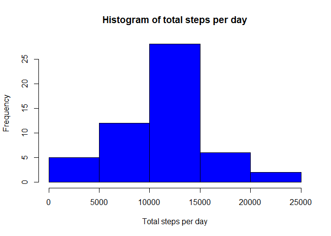
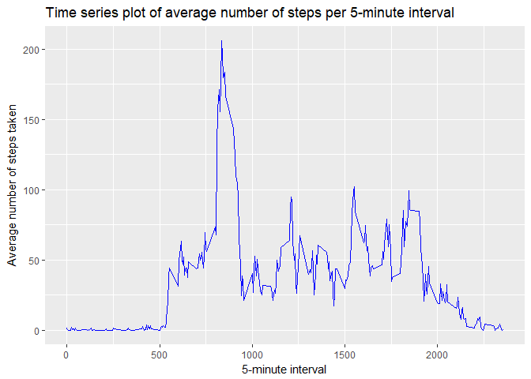
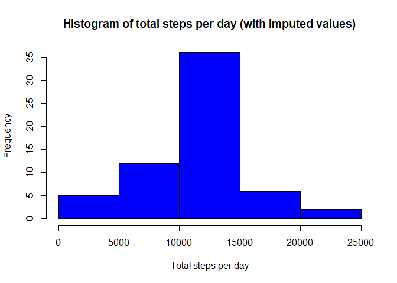
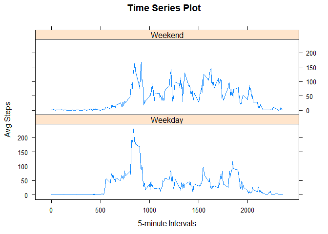

# Reproducible Research: Peer Assessment 1

Set up Knitr options and load required libraries:


```r
# Need to set the locale to English for the weekdays function to work correctly on non-English systems.
Sys.setlocale("LC_TIME", "English")
knitr::opts_chunk$set(echo = TRUE)
library(dplyr)
library(ggplot2)
library(lattice)
```


## Loading and preprocessing the data

Assuming that the dataset is located in the current working directory, let's unzip and load the data:


```r
unzip("activity.zip")
activity_data <- read.csv("activity.csv")
```

Inspecting the data:

```r
str(activity_data)
```

```
## 'data.frame':	17568 obs. of  3 variables:
##  $ steps   : int  NA NA NA NA NA NA NA NA NA NA ...
##  $ date    : Factor w/ 61 levels "2012-10-01","2012-10-02",..: 1 1 1 1 1 1 1 1 1 1 ...
##  $ interval: int  0 5 10 15 20 25 30 35 40 45 ...
```

```r
head(activity_data)
```

```
##   steps       date interval
## 1    NA 2012-10-01        0
## 2    NA 2012-10-01        5
## 3    NA 2012-10-01       10
## 4    NA 2012-10-01       15
## 5    NA 2012-10-01       20
## 6    NA 2012-10-01       25
```

```r
sum(!complete.cases(activity_data))
```

```
## [1] 2304
```

We see that there are 17568 observations and three variables as expected, so we're good to go.

Further, we can see that the date column is read as factors by `read.csv` so let's convert them into proper date format.


```r
activity_data$date <- as.Date(activity_data$date)
```

Finally, we see that there are a lot of missing values (2304 incomplete cases to be exact), so let's clean up the dataset so we don't have to deal with them later on:


```r
clean_data <- na.omit(activity_data)
```

## What is mean total number of steps taken per day?

Using `dplyr`'s `group_by` and `summarise` functions to sum the steps per day and storing the results in a new table:


```r
grouped_by_day <- clean_data %>% 
        group_by(date) %>% 
        summarise(steps = sum(steps))
```

Create histogram over daily step counts:


```r
hist(grouped_by_day$steps, 
     breaks = 5,
     col = "blue", 
     xlab = "Total steps per day", 
     ylab = "Frequency",
     main = "Histogram of total steps per day")
```

<!-- -->

The mean of total daily steps is:

```r
mean(grouped_by_day$steps, na.rm=TRUE)
```

```
## [1] 10766.19
```

The median of total daily steps is:

```r
median(grouped_by_day$steps, na.rm=TRUE)
```

```
## [1] 10765
```


## What is the average daily activity pattern?

Using `dplyr`'s `group_by` function to generate a new table grouped by 5-second intervals:


```r
grouped_by_interval <- clean_data %>% 
        group_by(interval) %>%
        summarise(steps = mean(steps))
```

Create time-series plot of average number of steps per time-interval:


```r
ggplot(data = grouped_by_interval, aes(interval, steps)) +
        geom_line(colour="blue") +
        ggtitle("Time series plot of average number of steps per 5-minute interval") +
        xlab("5-minute interval") +
        ylab("Average number of steps taken")
```

<!-- -->

Finding the time interval with the highest number of average steps:


```r
grouped_by_interval %>%
        slice(which.max(steps)) %>%
        select(interval) %>%
        as.integer()
```

```
## [1] 835
```

We see that the 835-minute interval (at index 104) has the highest average number of steps.

## Imputing missing values

Let's find out how many missing values there are:


```r
sum(is.na(activity_data$steps))
```

```
## [1] 2304
```

As we saw earlier, we still have 2304 missing values.

First, let's attempt to impute missing values by replacing NA with the average of the same time interval from the rest of the dataset. 


```r
# Creating a new table inclduing the average for each time-interval
# (The grouped_by_interval$steps is a 288 long vector which gets repated for each day in the created data frame, in effect giving us the correct average for each time-interval).
imputed_data <- cbind(activity_data, grouped_by_interval$steps)
names(imputed_data)[4] <- 'mean'
imputed_data$steps <- ifelse(is.na(imputed_data$steps), imputed_data$mean, imputed_data$steps)
```

Confirm that there are no more missing values:

```r
sum(is.na(imputed_data$steps))
```

```
## [1] 0
```

We don't need the 'mean' column anymore, so let's get rid of it:

```r
imputed_data <- select(imputed_data, -mean)
```

Calculating the daily step counts using the new dataset:

```r
imputed_by_day <- imputed_data %>% 
        group_by(date) %>% 
        summarise(steps = sum(steps))
```

Create histogram over daily step counts:


```r
hist(imputed_by_day$steps, 
     breaks = 5,
     col = "blue", 
     xlab = "Total steps per day", 
     ylab = "Frequency",
     main = "Histogram of total steps per day (with imputed values)")
```

<!-- -->

The mean of total daily steps using the data including imputed values is:

```r
mean(imputed_by_day$steps)
```

```
## [1] 10766.19
```

The median of total daily steps using the data including imputed values is:

```r
median(imputed_by_day$steps)
```

```
## [1] 10766.19
```

We can see that the mean is the same for the imputed and the original dataset. This makes sense since injecting the mean into the data will result in the same mean as before.

The median has changed and is now identical to the mean. A change here would be expected since by imputing missing data we now have a longer vector, and the median should move. The fact that the median is identical to the mean, indicates that the data at the median has been imputed.


## Are there differences in activity patterns between weekdays and weekends?


```r
imputed_data$wday <- "Weekday"
imputed_data$wday[weekdays(imputed_data$date) %in% c("Saturday", "Sunday")] <- "Weekend"
imputed_data$wday <- as.factor(imputed_data$wday)
```

Calculating new means for each time-interval grouped by type of day:

```r
imputed_by_wday <- aggregate(imputed_data$steps, 
                        by = list(imputed_data$interval, imputed_data$wday),
                        mean)
names(imputed_by_wday) <- c("interval", "wday", "steps")
```


Plotting the data:

```r
xyplot(steps ~ interval | wday, 
       imputed_by_wday, 
       layout=c(1,2), 
       type="l",
       main = "Time Series Plot", 
       xlab="5-minute Intervals", 
       ylab="Avg Steps")
```

<!-- -->

We can see from the plot that the activity levels are different between weekend and weekdays. Weekdays tend to have a high peak in the morning, followed by a lower activity period during the rest of the day. The weekend period seems to have a more even distribution of activity.
